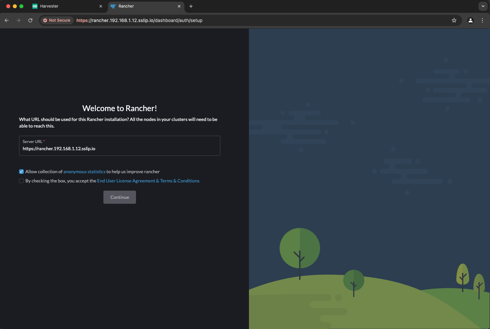
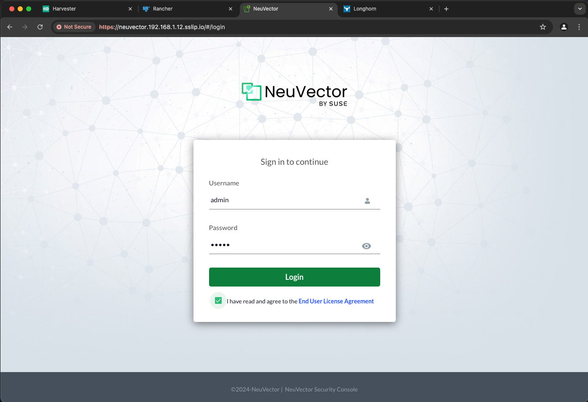
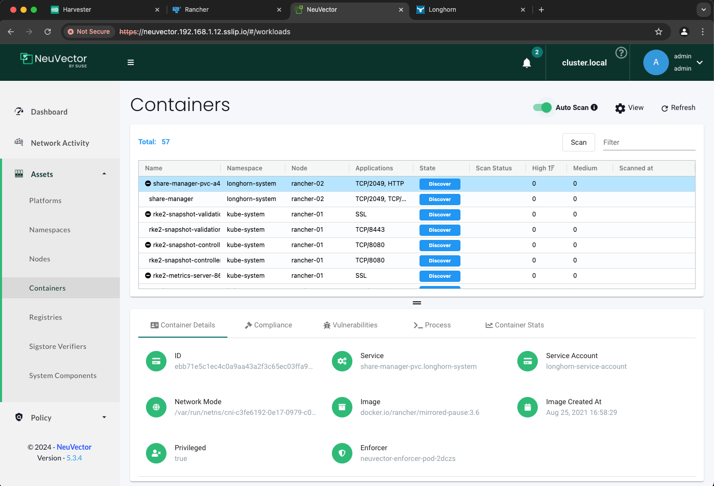

# Simple RKE2, Longhorn, NeuVector and Rancher Install - Updated 2024


Throughout my career there has always been a disconnect between the documentation and the practical implementation. The Kubernetes (k8s) ecosystem is no stranger to this problem. This guide is a simple approach to installing Kubernetes and some REALLY useful tools. We will walk through installing all the following.

- [RKE2](https://docs.rke2.io) - Security focused Kubernetes
- [Rancher](https://www.suse.com/products/suse-rancher/) - Multi-Cluster Kubernetes Management
- [Longhorn](https://longhorn.io) - Unified storage layer
- [NeuVector](https://www.suse.com/products/neuvector/) - Full Lifecycle Container Security

We will need a few tools for this guide. We will walk through how to install `helm` and `kubectl`.

Or [Watch the video](https://youtu.be/oM-6sd4KSmA).

**For more fun check out my list of other content and videos at https://rfed.io/links.**

---

> **Table of Contents**:
>
> * [Whoami](#whoami)
> * [Prerequisites](#prerequisites)
> * [Linux Servers](#linux-servers)
> * [RKE2 Install](#rke2-install)
>   * [RKE2 Server Install](#rke2-server-install)
>   * [RKE2 Agent Install](#rke2-agent-install)
> * [Rancher](#rancher)
>   * [Rancher Install](#rancher-install)
>   * [Rancher Gui](#rancher-gui)
> * [Longhorn](#longhorn)
>   * [Longhorn Install](#longhorn-install)
>   * [Longhorn Gui](#longhorn-gui)
> * [NeuVector](#neuvector)
>   * [NeuVector Install](#neuvector-install)
>   * [NeuVector Gui](#neuvector-gui)
> * [Automation](#automation)
> * [Conclusion](#conclusion)

---

## Whoami

Just a geek - Andy Clemenko - @clemenko - clemenko@gmail.com

## Prerequisites

The prerequisites are fairly simple. We need 3 linux servers with access to the internet. They can be bare metal, or in the cloud provider of your choice. I prefer [Digital Ocean](https://digitalocean.com). For this guide we are going to use [Harvester](https://harvesterhci.io/). We need an `ssh` client to connect to the servers. For the purpose of this guide let's use https://sslip.io/. We will need to know the IP of the first server of the cluster.

## Linux Servers

For the sake of this guide we are going to use [Ubuntu](https://ubuntu.com). Our goal is a simple deployment. The recommended size of each node is 4 Cores and 8GB of memory with at least 60GB of storage. One of the nice things about [Longhorn](https://longhorn.io) is that we do not need to attach additional storage. Here is an example list of servers. Please keep in mind that your server names can be anything. Just keep in mind which ones are the "server" and "agents".

| name | core | memory | ip | disk | os |
|---| --- | --- | --- | --- | --- |
|rancher-01 | 4 | 8Gi | 192.168.1.12 | 60 | Ubuntu 22.04 x64 |
|rancher-02 | 4 | 8Gi | 192.168.1.74 | 60 | Ubuntu 22.04 x64 |
|rancher-03 | 4 | 8Gi | 192.168.1.247 | 60 | Ubuntu 22.04 x64 |

For Kubernetes we will need to "set" one of the nodes as the control plane. Rancher-01 looks like a winner for this. First we need to `ssh` into all three nodes and make sure we have all the updates and add a few things. For the record I am not a fan of software firewalls. Please feel free to reach to me to discuss. :D

We need to run the following commands on each of your nodes. Make sure you pick the OS of choice.

**Ubuntu**:

```bash
# Ubuntu instructions 
# stop the software firewall
systemctl disable --now ufw

# get updates, install nfs, and apply
apt update
apt install nfs-common -y  
apt upgrade -y

# clean up
apt autoremove -y
```

**Rocky / Centos / RHEL**:

```bash
# Rocky instructions 
# stop the software firewall
systemctl disable --now firewalld

# get updates, install nfs, and apply
yum install -y nfs-utils cryptsetup iscsi-initiator-utils

# enable iscsi for Longhorn
systemctl enable --now iscsid.service 

# update all the things
yum update -y

# clean up
yum clean all
```

Cool, lets move on to the RKE2.

## RKE2 Install

### RKE2 Server Install (rancher-01)

Now that we have all the nodes up to date, let's focus on `rancher-01`. While this might seem controversial, `curl | bash` does work nicely. The install script will use the tarball install for **Ubuntu** and the RPM install for **Rocky/Centos**. Please be patient, the start command can take a minute. Here are the [rke2 docs](https://docs.rke2.io/install/methods/) and [install options](https://docs.rke2.io/install/configuration#configuring-the-linux-installation-script) for reference.

```bash
# On rancher-01
curl -sfL https://get.rke2.io | INSTALL_RKE2_TYPE=server sh - 

# we can set the token - create config dir/file
mkdir -p /etc/rancher/rke2/ 
echo "token: bootstrapAllTheThings" > /etc/rancher/rke2/config.yaml

# start and enable for restarts - 
systemctl enable --now rke2-server.service
```

Here is what the **Ubuntu** version should look like:


Let's validate everything worked as expected. Run a `systemctl status rke2-server` and make sure it is `active`.


Perfect! Now we can start talking Kubernetes. We need to symlink the `kubectl` cli on `rancher-01` that gets installed from RKE2.

```bash
# symlink all the things - kubectl
ln -s $(find /var/lib/rancher/rke2/data/ -name kubectl) /usr/local/bin/kubectl

# add kubectl conf with persistence, as per Duane
echo "export KUBECONFIG=/etc/rancher/rke2/rke2.yaml PATH=$PATH:/usr/local/bin/:/var/lib/rancher/rke2/bin/" >> ~/.bashrc
source ~/.bashrc

# check node status
kubectl get node
```

Hopefully everything looks good! Here is an example.


For those that are not TOO familiar with k8s, the config file is what `kubectl` uses to authenticate to the api service. If you want to use a workstation, jump box, or any other machine you will want to copy `/etc/rancher/rke2/rke2.yaml`. You will want to modify the file to change the ip address. 

### RKE2 Agent Install (rancher-02, rancher-03)

The agent install is VERY similar to the server install. Except that we need an agent config file before starting. We will start with `rancher-02`. We need to install the agent and setup the configuration file.

```bash
# we can export the rancher-01 IP from the first server.
export RANCHER1_IP=192.168.1.12   # <-- change this!

# we add INSTALL_RKE2_TYPE=agent
curl -sfL https://get.rke2.io | INSTALL_RKE2_TYPE=agent sh -  

# create config dir/file
mkdir -p /etc/rancher/rke2/ 

# change the ip to reflect your rancher-01 ip
cat << EOF >> /etc/rancher/rke2/config.yaml
server: https://$RANCHER1_IP:9345
token: bootstrapAllTheThings
EOF

# enable and start
systemctl enable --now rke2-agent.service
```

What should this look like:


Rinse and repeat. Run the same install commands on `rancher-03`. Next we can validate all the nodes are playing nice by running `kubectl get node -o wide` on `rancher-01`.


Huzzah! RKE2 is fully installed. From here on out we will only need to talk to the kubernetes api. Meaning we will only need to remain ssh'ed into `rancher-01`.

Now let's install Rancher.

## Rancher

For more information about the Rancher versions, please refer to the  [Support Matrix](https://www.suse.com/suse-rancher/support-matrix/all-supported-versions/). We are going to use the latest version. For additional reading take a look at the [Rancher docs](https://ranchermanager.docs.rancher.com).

### Rancher Install

For Rancher we will need [Helm](https://helm.sh/). We are going to live on the edge! Here are the [install docs](https://ranchermanager.docs.rancher.com/getting-started/installation-and-upgrade/install-upgrade-on-a-kubernetes-cluster) for reference.

```bash
# on the server rancher-01
# add helm
curl -#L https://raw.githubusercontent.com/helm/helm/main/scripts/get-helm-3 | bash

# add needed helm charts
helm repo add rancher-latest https://releases.rancher.com/server-charts/latest --force-update
helm repo add jetstack https://charts.jetstack.io --force-update
```

Quick note about Rancher. Rancher needs jetstack/cert-manager to create the self signed TLS certificates. We need to install it with the Custom Resource Definition (CRD). Please pay attention to the `helm` install for Rancher. The URL`rancher.192.168.1.12.sslip.io` will need to be changed to for your IP. Also notice I am setting the `bootstrapPassword` and replicas. This allows us to skip a step later. :D

```bash
# still on rancher-01

# helm install jetstack
helm upgrade -i cert-manager jetstack/cert-manager -n cert-manager --create-namespace --set crds.enabled=true

# helm install rancher
# CHANGE the IP to the one for rancher-01
export RANCHER1_IP=192.168.1.12
helm upgrade -i rancher rancher-latest/rancher --create-namespace --namespace cattle-system --set hostname=rancher.$RANCHER1_IP.sslip.io --set bootstrapPassword=bootStrapAllTheThings --set replicas=1
```

Now we can validate everything installed with a `helm list -A` or `kubectl get pod -A`. Keep in mind it may take a minute or so for all the pods to come up. GUI time...

### Rancher GUI

We should now able to get to the GUI at https://rancher.192.168.1.12.sslip.io. The good news is that be default rke2 installs with the `nginx` ingress controller. Keep in mind that the browser may show an error for the self signed certificate. 


Once past that you should see the following screen asking about the password. Remember the helm install? `bootStrapAllTheThings` is the password.


We need to validate the Server URL and accept the terms and conditions.



**AND we are in!** Switching to light mode.


### Rancher Design

Let's take a second and talk about Ranchers Multi-cluster design. Bottom line, Rancher can operate in a Spoke and Hub model. Meaning one k8s cluster for Rancher and then "downstream" clusters for all the workloads. Personally I prefer the decoupled model where there is only one cluster per Rancher install. This allows for continued manageability during networks outages. For the purpose of the is guide we are concentrate on the single cluster deployment. There is good [documentation](https://ranchermanager.docs.rancher.com/how-to-guides/new-user-guides/kubernetes-clusters-in-rancher-setup/register-existing-clusters) on "importing" downstream clusters.

Now let's install Longhorn.

## Longhorn

### Longhorn Install

There are two methods for installing. Rancher has Chart built in.


Now for the good news, [Longhorn docs](https://longhorn.io/docs/1.6.1/deploy/install/) show two easy install methods. Helm and `kubectl`. Let's stick with Helm for this guide.

```bash
# get charts
helm repo add longhorn https://charts.longhorn.io --force-update

# install
helm upgrade -i longhorn longhorn/longhorn --namespace longhorn-system --create-namespace
```

Fairly easy right?

### Longhorn GUI

One of the benefits of Rancher is its ability to adjust to what's installed. Meaning the Rancher GUI will see Longhorn is installed and provide a link. We can find it by navigating to the `local` cluster from the dashboard. Or clicking on the bull with horns icon on the left nav bar under the home. From there look 


This brings up the Longhorn GUI.


One of the other benefits of this integration is that rke2 also knows it is installed. Run `kubectl get sc` to show the storage classes.

```text
root@rancher-01:~# kubectl  get sc
NAME                 PROVISIONER          RECLAIMPOLICY   VOLUMEBINDINGMODE   ALLOWVOLUMEEXPANSION   AGE
longhorn (default)   driver.longhorn.io   Delete          Immediate           true                   3m58s
```

Now we have a default storage class for the cluster. This allows for the automatic creation of Physical Volumes (PVs) based on a Physical Volume Claim (PVC). The best part is that "it just works" using the existing, unused storage, on the three nodes. Take a look around in the gui. Notice the Volumes on the Nodes. For fun, here is a demo flask app that uses a PVC for Redis. `kubectl apply -f https://raw.githubusercontent.com/clemenko/k8s_yaml/master/flask_simple_nginx.yml`

Now let's install NeuVector.

## NeuVector

### NeuVector Install

Similar to Longhorn we are going to use `helm` for the install. We do have a choice to use Single Sign On (SSO) with Rancher's credentials. For this guide we are going to stick with independent username and password. The helm options for SSO are below if you want experiment.

```bash
# helm repo add
helm repo add neuvector https://neuvector.github.io/neuvector-helm/ --force-update

# helm install 
export RANCHER1_IP=192.168.1.12

helm upgrade -i neuvector --namespace cattle-neuvector-system neuvector/core --create-namespace --set manager.svc.type=ClusterIP --set controller.pvc.enabled=true --set controller.pvc.capacity=500Mi --set manager.ingress.enabled=true --set manager.ingress.host=neuvector.$RANCHER1_IP.sslip.io --set manager.ingress.tls=true 

# add for single sign-on
# --set controller.ranchersso.enabled=true --set global.cattle.url=https://rancher.$RANCHER1_IP.sslip.io
```

We should wait a few seconds for the pods to deploy.

```bash
kubectl get pod -n cattle-neuvector-system
```

It will take a minute for everything to become running.

```text
root@rancher-01:~# kubectl get pod -n cattle-neuvector-system
NAME                                        READY   STATUS    RESTARTS   AGE
neuvector-controller-pod-657599c5fd-2zfhh   1/1     Running   0          109s
neuvector-controller-pod-657599c5fd-qd2jx   1/1     Running   0          109s
neuvector-controller-pod-657599c5fd-qv5nv   1/1     Running   0          109s
neuvector-enforcer-pod-2dczs                1/1     Running   0          109s
neuvector-enforcer-pod-47r2q                1/1     Running   0          109s
neuvector-enforcer-pod-bg7rd                1/1     Running   0          109s
neuvector-manager-pod-66cfdb8779-f8qtj      1/1     Running   0          109s
neuvector-scanner-pod-fc48d77fc-b8hb9       1/1     Running   0          109s
neuvector-scanner-pod-fc48d77fc-h8lwd       1/1     Running   0          109s
neuvector-scanner-pod-fc48d77fc-mmmpx       1/1     Running   0          109s
```

Let's take a look at the GUI.

### NeuVector GUI

Similar to Longhorn, Rancher see that the application is installed and created a NavLink for it. We are going to click it or navigate to http://neuvector.192.168.1.12.sslip.io. The login is `admin/admin`. Make sure to check the EULA box.



Before taking a look around we should turn on "Auto Scan". This will automatically scan all images on the cluster. Navigate to Assets --> Containers. In the upper right there is a a toggle for Auto Scan. 



Hopefully you made it this far!

## Automation

Yes we can automate all the things. Here is the repo I use automating the complete stack https://github.com/clemenko/rke2. This repo is for entertainment purposes only. There I use tools like pdsh to run parallel ssh into the nodes to complete a few tasks. Ansible would be a good choice for this. But I am old and like bash. Sorry the script is a beast. I need to clean it up.

## Conclusion

As we can see, setting up RKE2, Rancher, NeuVector and Longhorn is not that complicated. We can get deploy Kubernetes, a storage layer, and a management gui in a few minutes. Simple, right? One of the added benefits of using the Suse / Rancher stack is that all the pieces are modular. Use only what you need, when you need it. Hope this was helpful. Please feel free reach out, or open any issues at https://github.com/clemenko/rke_install_blog.

thanks!


**For more fun check out my list of other content and videos at https://rfed.io/links.**