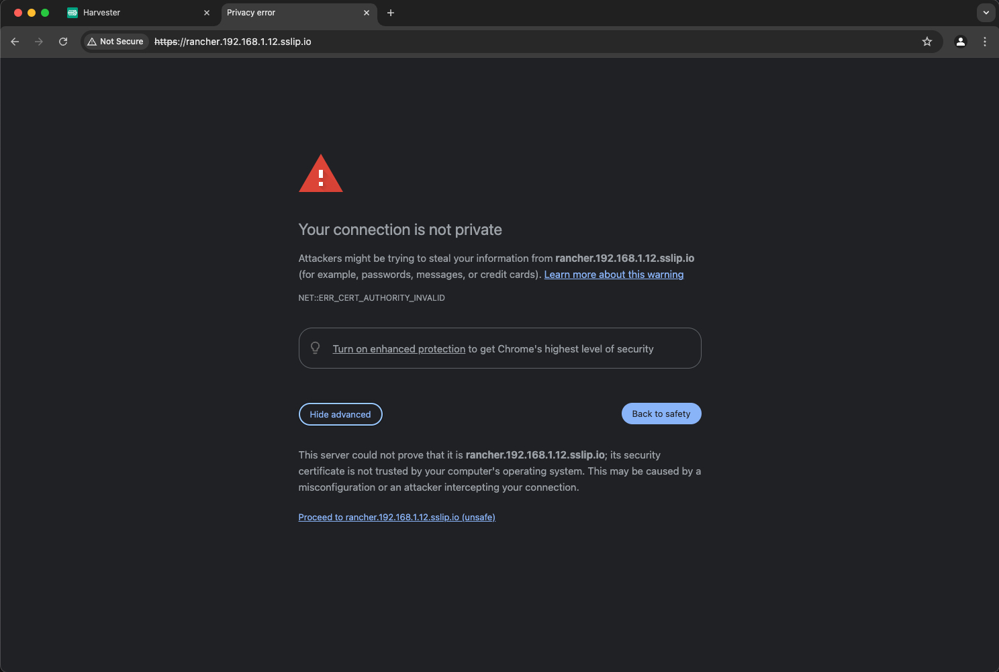

# Simple RKE2, Longhorn, and Rancher Install


Throughout my career there has always been a disconnect between the documentation and the practical implementation. The Kubernetes (k8s) ecosystem is no stranger to this problem. This guide is a simple approach to installing Kubernetes and some REALLY useful tools. We will walk through installing all the following.

- [RKE2](https://docs.rke2.io) - Security focused Kubernetes
- [Rancher](https://www.suse.com/products/suse-rancher/) - Multi-Cluster Kubernetes Management
- [Longhorn](https://longhorn.io) - Unified storage layer

We will need a few tools for this guide. We will walk through how to install `helm` and `kubectl`.

Or [Watch the video](https://youtu.be/oM-6sd4KSmA).

---

> **Table of Contents**:
>
> * [Whoami](#whoami)
> * [Prerequisites](#prerequisites)
> * [Linux Servers](#linux-servers)
> * [RKE2 Install - V1.24](#rke2-install)
>   * [RKE2 Server Install](#rke2-server-install)
>   * [RKE2 Agent Install](#rke2-agent-install)
> * [Rancher](#rancher)
>   * [Rancher Install](#rancher-install)
>   * [Rancher Gui](#rancher-gui)
> * [Longhorn](#longhorn)
>   * [Longhorn Install](#longhorn-install)
>   * [Longhorn Gui](#longhorn-gui)
> * [Automation](#automation)
> * [Conclusion](#conclusion)

---

## Whoami

Just a geek - Andy Clemenko - @clemenko - andy.clemenko@rancherfederal.com

## Prerequisites

The prerequisites are fairly simple. We need 3 linux servers with access to the internet. They can be bare metal, or in the cloud provider of your choice. I prefer [Digital Ocean](https://digitalocean.com). We need an `ssh` client to connect to the servers. And finally DNS to make things simple. Ideally we need a URL for the Rancher interface. For the purpose of this guide let's use `rancher.dockr.life`. We will need to point that name to the first server of the cluster. While we are at it, a wildcard DNS for your domain will help as well.

## Linux Servers

For the sake of this guide we are going to use [Ubuntu](https://ubuntu.com). Our goal is a simple deployment. The recommended size of each node is 4 Cores and 8GB of memory with at least 60GB of storage. One of the nice things about [Longhorn](https://longhorn.io) is that we do not need to attach additional storage. Here is an example list of servers. Please keep in mind that your server names can be anything. Just keep in mind which ones are the "server" and "agents".

| name | ip | memory | core | disk | os |
|---| --- | --- | --- | --- | --- |
|rancher1| 142.93.189.52  | 8192 | 4 | 160 | Ubuntu 21.10 x64 |
|rancher2| 68.183.150.214 | 8192 | 4 | 160 | Ubuntu 21.10 x64 |
|rancher3| 167.71.188.101 | 8192 | 4 | 160 | Ubuntu 21.10 x64 |


For Kubernetes we will need to "set" one of the nodes as the control plane. Rancher1 looks like a winner for this. First we need to `ssh` into all three nodes and make sure we have all the updates and add a few things. For the record I am not a fan of software firewalls. Please feel free to reach to me to discuss. :D

**Ubuntu**:

```bash
# Ubuntu instructions 
# stop the software firewall
systemctl disable --now ufw

# get updates, install nfs, and apply
apt update
apt install nfs-common -y  
apt upgrade -y

# clean up
apt autoremove -y
```

**Rocky / Centos / RHEL**:

```bash
# Rocky instructions 
# stop the software firewall
systemctl disable --now firewalld

# get updates, install nfs, and apply
yum install -y nfs-utils cryptsetup iscsi-initiator-utils

# enable iscsi for Longhorn
systemctl enable --now iscsid.service 

# update all the things
yum update -y

# clean up
yum clean all
```

Cool, lets move on to the RKE2.

## RKE2 Install

### RKE2 Server Install

Now that we have all the nodes up to date, let's focus on `rancher1`. While this might seem controversial, `curl | bash` does work nicely. The install script will use the tarball install for **Ubuntu** and the RPM install for **Rocky/Centos**. Please be patient, the start command can take a minute. Here are the [rke2 docs](https://docs.rke2.io/install/methods/) and [install options](https://docs.rke2.io/install/configuration#configuring-the-linux-installation-script) for reference.

>**It is important to note that we are installing v1.26 in this guide. There are some changes in v1.25 that require a few modifications. I will note them below.**

```bash
# On rancher1
curl -sfL https://get.rke2.io | INSTALL_RKE2_CHANNEL=v1.26 INSTALL_RKE2_TYPE=server sh - 

# start and enable for restarts - 
systemctl enable --now rke2-server.service
```

Here is what the **Ubuntu** version should look like:


Let's validate everything worked as expected. Run a `systemctl status rke2-server` and make sure it is `active`.


Perfect! Now we can start talking Kubernetes. We need to symlink the `kubectl` cli on `rancher1` that gets installed from RKE2.

```bash
# symlink all the things - kubectl
ln -s $(find /var/lib/rancher/rke2/data/ -name kubectl) /usr/local/bin/kubectl

# add kubectl conf
export KUBECONFIG=/etc/rancher/rke2/rke2.yaml 

# check node status
kubectl get node
```

We will also need to get the token from rancher1.

```bash
# save this for rancher2 and rancher3
cat /var/lib/rancher/rke2/server/node-token
```

Hopefully everything looks good! Here is an example.


For those that are not TOO familiar with k8s, the config file is what `kubectl` uses to authenticate to the api service. If you want to use a workstation, jump box, or any other machine you will want to copy `/etc/rancher/rke2/rke2.yaml`. You will want to modify the file to change the ip address. We will need one more file from `rancher1`, aka the server, the agent join token. Copy `/var/lib/rancher/rke2/server/node-token`, we will need it for the agent install.

Side note on Tokens. RKE2 uses the TOKEN as a way to authenticate the agent to the server service. This is a much better system than "trust on first use". The goal of the token process is to setup a control plane Mutual TLS (mtls) certificate termination.

### RKE2 Agent Install

The agent install is VERY similar to the server install. Except that we need an agent config file before starting. We will start with `rancher2`. We need to install the agent and setup the configuration file.

```bash
# we can export the rancher1 IP from the first server.
export RANCHER1_IP=192.168.1.1  # change this!

# and we can export the token from rancher1.
export TOKEN=something_magical # change this as well.

# we add INSTALL_RKE2_TYPE=agent
curl -sfL https://get.rke2.io | INSTALL_RKE2_CHANNEL=v1.26 INSTALL_RKE2_TYPE=agent sh -  

# create config file
mkdir -p /etc/rancher/rke2/ 

# change the ip to reflect your rancher1 ip
echo "server: https://$RANCHER1_IP:9345" > /etc/rancher/rke2/config.yaml

# change the Token to the one from rancher1 /var/lib/rancher/rke2/server/node-token 
echo "token: $TOKEN" >> /etc/rancher/rke2/config.yaml

# enable and start
systemctl enable --now rke2-agent.service
```

What should this look like:


Rinse and repeat. Run the same install commands on `rancher3`. Next we can validate all the nodes are playing nice by running `kubectl get node -o wide` on `rancher1`. 


Huzzah! RKE2 is fully installed. From here on out we will only need to talk to the kubernetes api. Meaning we will only need to remain ssh'ed into `rancher1`.

## Rancher

For more information about the Rancher versions, please refer to the  [Support Matrix](https://www.suse.com/suse-rancher/support-matrix/all-supported-versions/rancher-v2-6-3/). We are going to use the latest version. For additional reading take a look at the [Rancher docs](https://rancher.com/docs/rancher/v2.6/en/).

### Rancher Install

For Rancher we will need [Helm](https://helm.sh/). We are going to live on the edge! Here are the [install docs](https://rancher.com/docs/rancher/v2.6/en/installation/install-rancher-on-k8s/) for reference.

```bash
# on the server rancher1
# add helm
curl -#L https://raw.githubusercontent.com/helm/helm/main/scripts/get-helm-3 | bash

# add needed helm charts
helm repo add rancher-latest https://releases.rancher.com/server-charts/latest
helm repo add jetstack https://charts.jetstack.io
```

Quick note about Rancher. Rancher needs jetstack/cert-manager to create the self signed TLS certificates. We need to install it with the Custom Resource Definition (CRD). Please pay attention to the `helm` install for Rancher. The URL will need to be changed to fit your FQDN. Also notice I am setting the `bootstrapPassword` and replicas. This allows us to skip a step later. :D

```bash
# still on  rancher1

# helm install jetstack
helm upgrade -i cert-manager jetstack/cert-manager -n cert-manager --create-namespace --set installCRDs=true

# helm install rancher
helm upgrade -i rancher rancher-latest/rancher --create-namespace --namespace cattle-system --set hostname=rancher.dockr.life --set bootstrapPassword=bootStrapAllTheThings --set replicas=1
```

Here is what it should look like.

```text
root@rancher1:~# helm repo add rancher-latest https://releases.rancher.com/server-charts/latest
"rancher-latest" has been added to your repositories

root@rancher1:~# helm repo add jetstack https://charts.jetstack.io
"jetstack" has been added to your repositories

root@rancher1:~# helm upgrade -i cert-manager jetstack/cert-manager --namespace cert-manager --create-namespace
Release "cert-manager" does not exist. Installing it now.
NAME: cert-manager
LAST DEPLOYED: Mon Mar 21 14:14:47 2022
NAMESPACE: cert-manager
STATUS: deployed
REVISION: 1
TEST SUITE: None
NOTES:
cert-manager v1.7.1 has been deployed successfully!

In order to begin issuing certificates, you will need to set up a ClusterIssuer
or Issuer resource (for example, by creating a 'letsencrypt-staging' issuer).

More information on the different types of issuers and how to configure them
can be found in our documentation:

https://cert-manager.io/docs/configuration/

For information on how to configure cert-manager to automatically provision
Certificates for Ingress resources, take a look at the `ingress-shim`
documentation:

https://cert-manager.io/docs/usage/ingress/

root@rancher1:~# helm upgrade -i rancher rancher-latest/rancher --create-namespace --namespace cattle-system --set hostname=rancher.dockr.life --set bootstrapPassword=bootStrapAllTheThings --set replicas=1
Release "rancher" does not exist. Installing it now.
NAME: rancher
LAST DEPLOYED: Mon Mar 21 14:15:08 2022
NAMESPACE: cattle-system
STATUS: deployed
REVISION: 1
TEST SUITE: None
NOTES:
Rancher Server has been installed.

NOTE: Rancher may take several minutes to fully initialize. Please standby while Certificates are being issued, Containers are started and the Ingress rule comes up.

Check out our docs at https://rancher.com/docs/

If you provided your own bootstrap password during installation, browse to https://rancher.dockr.life to get started.

If this is the first time you installed Rancher, get started by running this command and clicking the URL it generates:

\```
echo https://rancher.dockr.life/dashboard/?setup=$(kubectl get secret --namespace cattle-system bootstrap-secret -o go-template='{{.data.bootstrapPassword|base64decode}}')
\```

To get just the bootstrap password on its own, run:

\```
kubectl get secret --namespace cattle-system bootstrap-secret -o go-template='{{.data.bootstrapPassword|base64decode}}{{ "\n" }}'
\```

Happy Containering!
root@rancher1:~#
```

We can also run a `kubectl get pod -A` to see if everything is running. Keep in mind it may take a minute or so for all the pods to come up. GUI time...

### Rancher GUI

Assuming DNS is pointing to first server, `rancher1` for me, we should be able to get to the GUI. The good news is that be default rke2 installs with the `nginx` ingress controller. Keep in mind that the browser may show an error for the self signed certificate. In the case of Chrome you can type "thisisunsafe" and it will let you proceed.



Once past that you should see the following screen asking about the password. Remember the helm install? `bootStrapAllTheThings` is the password.


We need to validate the Server URL and accept the terms and conditions. And we are in!


### Rancher Design

Let's take a second and talk about Ranchers Multi-cluster design. Bottom line, Rancher can operate in a Spoke and Hub model. Meaning one k8s cluster for Rancher and then "downstream" clusters for all the workloads. Personally I prefer the decoupled model where there is only one cluster per Rancher install. This allows for continued manageability during networks outages. For the purpose of the is guide we are concentrate on the single cluster deployment. There is good [documentation](https://rancher.com/docs/rancher/v2.6/en/cluster-provisioning/registered-clusters/) on "importing" downstream clusters.

## Longhorn

### Longhorn Install

There are two methods for installing. Rancher has Chart built in.


Now for the good news, [Longhorn docs](https://longhorn.io/docs/1.2.4/deploy/install/) show two easy install methods. Helm and `kubectl`. Let's stick with Helm for this guide.

```bash
# get charts
helm repo add longhorn https://charts.longhorn.io

# update
helm repo update

# install
helm upgrade -i longhorn longhorn/longhorn --namespace longhorn-system --create-namespace
```

Fairly easy right?

### Longhorn GUI

One of the benefits of Rancher is its ability to adjust to what's installed. Meaning the Rancher GUI will see Longhorn is installed and provide a link. Click it.


This brings up the Longhorn GUI.


One of the other benefits of this integration is that rke2 also knows it is installed. Run `kubectl get sc` to show the storage classes.

```text
root@rancher1:~# kubectl  get sc
NAME                 PROVISIONER          RECLAIMPOLICY   VOLUMEBINDINGMODE   ALLOWVOLUMEEXPANSION   AGE
longhorn (default)   driver.longhorn.io   Delete          Immediate           true                   3m58s
```

Now we have a default storage class for the cluster. This allows for the automatic creation of Physical Volumes (PVs) based on a Physical Volume Claim (PVC). The best part is that "it just works" using the existing, unused storage, on the three nodes. Take a look around in the gui. Notice the Volumes on the Nodes. For fun, here is a demo flask app that uses a PVC for Redis. `kubectl apply -f https://raw.githubusercontent.com/clemenko/k8s_yaml/master/flask_simple_nginx.yml`

## Automation

Yes we can automate all the things. Here is the repo I use automating the complete stack https://github.com/clemenko/rke2. This repo is for entertainment purposes only. There I use tools like pdsh to run parallel ssh into the nodes to complete a few tasks. Ansible would be a good choice for this. But I am old and like bash. Sorry the script is a beast. I need to clean it up.

## Conclusion

As we can see, setting up RKE2, Rancher and Longhorn is not that complicated. We can get deploy Kubernetes, a storage layer, and a management gui in a few minutes. Simple, right? One of the added benefits of using the Suse / Rancher stack is that all the pieces are modular. Use only what you need, when you need it. Hope this was helpful. Please feel free reach out, or open any issues at https://github.com/clemenko/rke_install_blog. 

thanks!


